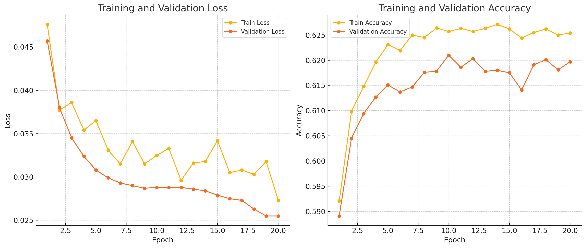

# Autoencoder for Data Imputation

This project uses an autoencoder model to perform data imputation on the UCI Adult dataset. The model learns to reconstruct missing values for both continuous and categorical features.

## Project Overview

This repository contains:

- A PyTorch autoencoder implementation for imputing missing data.
- Data preprocessing and feature engineering specifically for the Adult dataset.
- Training, evaluation, and testing scripts to measure reconstruction accuracy.

## Installation

1. Clone the repository:

   ```bash
   git clone https://github.com/Frank-The-Coder/autoencoder-data-imputation.git
   cd autoencoder-data-imputation
   ```

2. Set up a virtual environment (optional but recommended):

   ```bash
   python -m venv venv
   source venv/bin/activate  # On Windows, use `venv\Scripts\activate`
   ```

3. Install dependencies:
   ```bash
   pip install -r requirements.txt
   ```

## Dataset

The model uses the **UCI Adult Dataset** from the UCI Machine Learning Repository. The dataset contains demographic information to predict whether an individual's income exceeds $50,000 per year. Below is a summary of the features used in this project:

### Features

| Feature        | Type        | Description                                 |
| -------------- | ----------- | ------------------------------------------- |
| age            | Continuous  | Age of the individual                       |
| workclass      | Categorical | Type of employer or work relationship       |
| fnlwgt         | Continuous  | Final weight (population estimate)          |
| education      | Categorical | Highest level of education achieved         |
| education-num  | Continuous  | Numerical representation of education level |
| marital-status | Categorical | Marital status of the individual            |
| occupation     | Categorical | Occupation of the individual                |
| relationship   | Categorical | Relationship status in the household        |
| race           | Categorical | Race of the individual                      |
| sex            | Categorical | Gender of the individual                    |
| capital-gain   | Continuous  | Capital gains in income                     |
| capital-loss   | Continuous  | Capital losses in income                    |
| hours-per-week | Continuous  | Average work hours per week                 |
| native-country | Categorical | Country of birth or origin                  |

The dataset has been preprocessed to handle missing values, normalize continuous features, and encode categorical features.

## Usage

### Data Preprocessing and Training

1. **Run the main script** to preprocess data, train the model, and evaluate its performance:

   ```bash
   python main.py
   ```

2. **Output**: Training and validation performance, as well as final test accuracy and loss, will display in the console.



3. **Saved Model**: The trained model will be saved in the `saved_model/` directory.

### Project Structure

```plaintext
autoencoder-data-imputation/
│
├── src/
│   ├── data_loader.py       # Code to load and preprocess the dataset
│   ├── model.py             # Autoencoder model architecture
│   ├── train.py             # Training and validation functions
│   ├── evaluate.py          # Evaluation function for test performance
│   ├── utils.py             # Utility functions for feature extraction and accuracy
├── saved_model/             # Directory for saved models
├── main.py                  # Main script to run the project
├── requirements.txt         # Project dependencies
└── README.md                # Project documentation
```

## Requirements

- Python 3.8 or higher
- Dependencies listed in `requirements.txt`

## Results

- **Final Test Accuracy**: ~57%
- **Final Test Loss**: ~0.021

This accuracy indicates moderate reconstruction capability, suitable for basic imputation tasks.

## Future Work

Consider experimenting with:

- Denoising techniques for improved generalization.
- Adjusting hyperparameters (e.g., learning rate, dropout) to further optimize accuracy.

## License

This project is licensed under the MIT License - see the [LICENSE](LICENSE) file for details.
